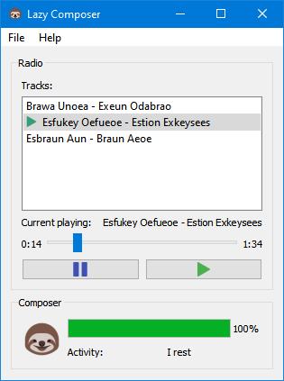

# LazyComposer
Simple midi music generator

<b><a href="/../../releases">Download</a></b> |
[Examples MIDI](examples) |
<a href="https://www.youtube.com/watch?v=H6xje6YJQ-k">Video</a>

  

* Just launch the program and enjoy the masterpiece music!
* Make sure your device supports midi playback
* You can also switch tracks and save songs to file

# How to build
1. Install Qt 5 or 6
2. Clone repo
3. Open src/LazyComposer.pro in QtCreator and build
